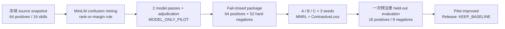
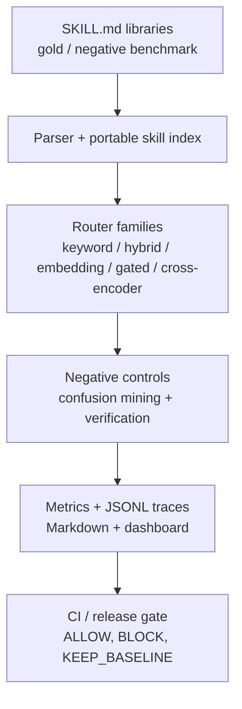

<p align="right">
  <a href="./README.md"></a>
  <a href="./README_EN.md"></a>
</p>

# Hermes SkillEval

[](https://www.python.org/downloads/)
[](https://github.com/Raidriar7170/hermes-skilleval/actions/workflows/validate.yml)
[](https://github.com/Raidriar7170/hermes-skilleval/releases/tag/v0.3.0)
[](action.yml)
[](benchmarks)
[](LICENSE)

**面向 AI 编程 Agent 的技能路由评测、难负样本训练与发布门禁系统。**

Hermes SkillEval 解决一个具体问题：当 Claude Code、Codex、Cursor 一类 Agent
拥有越来越多相似的 `SKILL.md` 技能时，如何选中正确技能，同时识别“语义相关但
职责错误”的近邻技能，并在回归进入默认路由器前阻止发布。

[30 秒总览](#30-秒理解项目) · [核心实现](#我实现的算法与工程模块) ·
[Router V2](#router-v2-如何训练) · [结果](#关键量化结果) ·
[限制](#先看限制) · [快速开始](#快速开始) · [证据](#证据与复现入口)

## 30 秒理解项目

| 招聘者最关心的问题 | 回答 |
|---|---|
| 项目解决什么问题？ | 评测 Agent 技能路由的正确性与负样本风险，定位相似技能混淆，并用 CI / release gate 阻止有风险的候选路由器升级。 |
| 我实现了什么？ | `SKILL.md` 解析与索引、带 gold/negative 标签的 benchmark、五类 router、混淆挖掘、难负样本审核与训练包、SentenceTransformer 训练、配对评测、证据链和可复用 GitHub Action。 |
| Router V2 怎么训练？ | 基于冻结的 MiniLM，使用 64 个正样本与 52 个审核后 hard negatives；正样本用 `MultipleNegativesRankingLoss`，难负样本用 `ContrastiveLoss`，三臂、三随机种子、预注册门禁。 |
| 结果如何？ | Arm A → C 的 Recall@1 从 `12/16` 提升到 `16/16`，Recall@5 保持 `16/16`，Negative Hit Rate@1 从 `1/9` 降到 `0/9`，三组配对运行的 Negative Hit Rate@5 从 `24/27` 降到 `18/27`。 |
| 最终结论是什么？ | Pilot 内部结论为 `ROUTER_V2_PILOT_IMPROVED`；但 blind-v2 未运行，因此路由器决策仍为 `KEEP_BASELINE`，不可发布或升级默认路由器。 |

## 关键量化结果

Router V2 pilot-002 复用了 pilot-001 冻结的 A/B/C 模型快照，未重新训练，完成了
唯一一次预注册 held-out evaluation attempt。下面是决策所使用的 Arm A 与 Arm C
配对结果：

| 指标 | Arm A：冻结基础模型 | Arm C：正样本 + 混淆难负样本 | 结果 |
|---|---:|---:|---|
| Recall@1 | `12/16` | `16/16` | 每个 seed 均提升 4 个任务 |
| Recall@5 | `16/16` | `16/16` | 保持不变 |
| MRR | `0.859375` | `1.000000` | `+0.140625` |
| NDCG@5 | `0.895217` | `1.000000` | `+0.104783` |
| Negative Hit Rate@1 | `1/9` | `0/9` | 每个 seed 均消除 top-1 negative hit |
| Negative Hit Rate@5 | `8/9` | `6/9`、`7/9`、`5/9` | 三个 seed 合计 `24/27 → 18/27` |
| p95 latency ratio | — | mean `0.950814` | 三个 seed 均未超过 `1.20` 门限 |

Recall@5、MRR、NDCG@5、Negative Hit Rate@5 与 p95 latency 的预注册门限均通过，
因此 pilot evaluation conclusion 是 `ROUTER_V2_PILOT_IMPROVED`。完整逐 seed
指标、paired wins/losses 与 failure slices 见
[pilot-002 result report](artifacts/router-v2-v4/internal-training-pilot/router-v2-v4-confusion-mined-pilot-002-eval-replay/result-report.md)。

## 先看限制

- 这是 `MODEL_ONLY_PILOT`：`human_reviewer_count=0`、
  `independent_human_review=false`、`model_correlation_risk=true`。两次模型审核和
  模型裁决不等于独立人类标注。
- 最终评测只有 16 个 held-out positive tasks 和 9 个 supported negative labels；
  这是自建 Hermes-style benchmark，不是公开标准 benchmark、排行榜或 SOTA 证据。
- Arm C 虽然 top-1 指标改善，但每个 seed 仍有 `5–7/9` 个 Negative Hit@5，且
  各有 `7/16` 个任务触发至少一个诊断 flag；结果不能解释为“混淆问题已经解决”。
- pilot-002 只进行一次预注册评测，没有 best-seed selection、重跑或事后调参；
  blind-v2 未运行，`release_eligible=false`，默认决策仍为 `KEEP_BASELINE`。
- 冻结的 canonical pilot manifest 缺少四个 model-only truth fields；仓库保留原始
  manifest，并通过自封存的
  [`truth-erratum.json`](artifacts/router-v2-v4/internal-training-pilot/router-v2-v4-confusion-mined-pilot-002-eval-replay/truth-erratum.json)
  补充事实块，而不是改写历史。
- 模型 checkpoint、embedding cache 和远端机器隐私信息不提交到仓库。本项目不是
  SaaS、runtime MCP router、自动 merge/release 系统，也没有 Marketplace 发布声明。

## 我实现的算法与工程模块

| 模块 | 核心实现 | 代码与证据 |
|---|---|---|
| 技能语料与评测契约 | 解析 YAML frontmatter 与 `SKILL.md` 正文，建立可移植 skill index；加载 gold / negative labels 并生成可复现指标与报告。 | [`skill_parser.py`](src/hermes_skilleval/skill_parser.py), [`skill_index.py`](src/hermes_skilleval/skill_index.py), [`metrics.py`](src/hermes_skilleval/metrics.py) |
| 多策略检索与排序 | 实现 keyword、hybrid、embedding、verification-gated 和 cross-encoder router，共用同一评测接口。 | [`routers/`](src/hermes_skilleval/routers), [`comparison.py`](src/hermes_skilleval/comparison.py) |
| Router V2 数据与混淆挖掘 | 建立 prompt-only query contract、冻结 source snapshot、MiniLM baseline-confusion mining、两次隔离模型审核与一次裁决，以及 fail-closed admission。 | [`router_query.py`](src/hermes_skilleval/router_query.py), [`router_v2_reviewed_source.py`](src/hermes_skilleval/router_v2_reviewed_source.py), [`router_v2_model_review.py`](src/hermes_skilleval/router_v2_model_review.py) |
| 难负样本训练管线 | 构建 64 positive + 52 hard-negative 的内部训练包、skill-unique deterministic sampler、MNRL + ContrastiveLoss 训练与模型 lineage manifest。 | [`router_v2_internal_package.py`](src/hermes_skilleval/router_v2_internal_package.py), [`router_v2_training_pilot.py`](src/hermes_skilleval/router_v2_training_pilot.py), [`train_embedding_router.py`](scripts/train_embedding_router.py) |
| 预注册评测与发布门禁 | 实现三 seed 配对评测、attempt ledger、聚合指标、failure slices、artifact hash 审计、release selector 和 GitHub Action gate。 | [`router_v2_pilot_evaluation_runner.py`](src/hermes_skilleval/router_v2_pilot_evaluation_runner.py), [`release_selector.py`](src/hermes_skilleval/release_selector.py), [`github_action_gate.py`](src/hermes_skilleval/github_action_gate.py) |

## Router V2 如何训练

### 数据与审核

- 冻结基础模型：`sentence-transformers/all-MiniLM-L6-v2`，固定 revision
  `1110a243fdf4706b3f48f1d95db1a4f5529b4d41`。
- 训练输入：64 个 train positives + 52 个 admitted hard negatives，共 116 对。
- 混淆挖掘：在冻结的 16-skill index 上运行单线程 CPU baseline；候选满足
  `rank <= 5` 或 `gold_score - candidate_score <= 0.05` 才可能进入审核。
- 审核：新候选经过两次隔离的模型 pass 与一次模型 adjudication；disputed、
  ambiguous、unsupported、easy negative 和 held-out rows 全部排除在训练外。
- 数据隔离：held-out labels 在训练前单独封存，不进入 mining、sampler、训练或
  hyperparameter decisions。

### 训练配置

| 项目 | 配置 |
|---|---|
| Arm A | 冻结 Base MiniLM，仅评测 |
| Arm B | positive-only Router V2，用于解释，不参与最终决策门禁 |
| Arm C | positive + admitted baseline-confusion hard negatives |
| Positive objective | `MultipleNegativesRankingLoss` |
| Hard-negative objective | `ContrastiveLoss(margin=1.5)` |
| Sampler | `skill-unique-v1`；同一 MNRL batch 内每个 skill 最多出现一次 |
| Seeds | `7170`, `7171`, `7172` |
| Hyperparameters | 3 epochs，batch size 16，AdamW，learning rate `2e-5` |
| 决策比较 | 只比较 paired Arm C vs Arm A；Arm B 仅作解释 |



## 为什么需要发布门禁

项目不只报告“更高的 Recall”。Phase 16 的 blind-validation 捕获过一个具体回归：
fine-tuned candidate 保留了 gold skill，却新增选择了错误的 negative skill。

| 字段 | 证据 |
|---|---|
| Blind task | `blind-claude-mcp-routing` |
| Gold skill | `mcp-tool-routing` |
| Tempting negative | `slash-command-workflow` |
| Baseline top-5 | 保留 gold，未选择 negative |
| Fine-tuned top-5 | 保留 gold，但新增选择 negative |
| Release result | Phase 17 `KEEP_BASELINE`；Phase 18 复现该决策 |

精确 route diff 见
[`route-diffs.jsonl`](docs/demo/phase16-blind-validation/route-diffs.jsonl)。这说明
项目的目标不是为模型改善找理由，而是让候选模型在证据不足或负样本风险变坏时
无法升级。

## 快速开始

```bash
git clone https://github.com/Raidriar7170/hermes-skilleval.git
cd hermes-skilleval
python -m venv .venv
source .venv/bin/activate
python -m pip install -e ".[dev]"

skilleval github-action-gate \
  --skill-path examples/github-action/skills \
  --benchmark-path examples/github-action/benchmark \
  --min-recall-at-k 1.0 \
  --max-negative-hit-rate 0.0 \
  --output-dir "${TMPDIR:-/tmp}/skilleval-gate"

pytest -q
```

示例 gate 预期返回 `ALLOW_MERGE`。完整 CLI 说明见
[`docs/usage.md`](docs/usage.md)。

## 作为 GitHub Action 使用

消费方仓库只需提供自己的 `skills/` 与 `benchmark/`：

```yaml
name: SkillEval Gate

on:
  pull_request:
  workflow_dispatch:

jobs:
  skilleval:
    runs-on: ubuntu-latest
    steps:
      - uses: actions/checkout@v4
      - uses: actions/setup-python@v5
        with:
          python-version: "3.11"
      - uses: Raidriar7170/hermes-skilleval@v0.3.0
        with:
          skill-path: skills
          benchmark-path: benchmark
          min-recall-at-k: "1.0"
          max-negative-hit-rate: "0.0"
          upload-artifacts: "true"
```

该 Action 运行 `skilleval github-action-gate`，输出 GitHub Actions step summary、
gate report、CI summary 与结果 artifacts，不需要 GitHub API token。它只报告
`ALLOW_MERGE` 或 `BLOCK_MERGE`，不会自动批准或合并 PR。

## 系统架构



核心原则：

- **Offline-first：** keyword、hybrid 与 hashing embedding 默认无需 LLM API。
- **Negative-aware：** Recall 与 Negative Hit Rate 同时进入报告和门禁。
- **Evidence-first：** 关键产物记录 source hash、config、seed、模型 lineage 与
  attempt 状态，避免只保留最终分数。
- **Fail-closed：** 数据、模型、held-out 或 gate contract 不完整时停止，而不是
  用默认值继续。

### Dashboard

[打开已提交的静态 Dashboard](https://raidriar7170.github.io/hermes-skilleval/docs/demo/phase8-static-dashboard/dashboard.html)
可按 run 过滤、检查失败样本、查看排名和原始 JSON 证据。


## 项目规模与技术栈

| 项目 | 当前范围 |
|---|---|
| 通用 benchmark | 80 tasks / 45 Hermes-style skills |
| Router families | keyword、hybrid、embedding、gated、cross-encoder |
| Router V2 pilot | 16 frozen skills、64 train positives、52 admitted hard negatives |
| Router V2 evaluation | 16 held-out positives、9 supported negatives、3 seeds |
| Runtime | Python 3.11、argparse、dataclasses、PyYAML |
| ML | sentence-transformers MiniLM、MNRL、ContrastiveLoss、cross-encoder |
| 证据输出 | JSON / JSONL、Markdown、GitHub Actions summary、静态 HTML dashboard |
| 验证 | pytest、GitHub Actions、hash-bound manifests、release checks |

## 证据与复现入口

| 证据 | 说明 |
|---|---|
| [Router V2 pilot-002 result report](artifacts/router-v2-v4/internal-training-pilot/router-v2-v4-confusion-mined-pilot-002-eval-replay/result-report.md) | 原始计数、逐 seed 指标、门禁、paired wins/losses、failure slices 与 lineage |
| [Router V2 evaluation summary](artifacts/router-v2-v4/internal-training-pilot/router-v2-v4-confusion-mined-pilot-002-eval-replay/evaluation/attempt-1/artifacts/evaluation-summary.json) | 机器可读的 `ROUTER_V2_PILOT_IMPROVED / KEEP_BASELINE` 事实面 |
| [Router V2 data manifest](artifacts/router-v2-v4/internal-training-pilot/router-v2-v4-confusion-mined-pilot-001/package/router-v2-v4-internal-training-package-001/data-manifest.json) | 64 positive、52 hard negative、排除规则与 review truth block |
| [Phase 16 blind validation](docs/demo/phase16-blind-validation/comparison.md) | 候选路由器新增 negative hit 的反例 |
| [Phase 17 release decision](docs/demo/phase17-calibrated-release-selector/release-decision.json) | `baseline-minilm` 保持默认 |
| [Phase 18 reproducibility manifest](docs/demo/phase18-ci-release-reproducibility/release-manifest.json) | CI-backed decision reproduction |
| [Evidence map](docs/evidence-map.md) | release、diagnostic、external validation、CI 与 Human Brief 导航 |
| [中文项目详解](https://raidriar7170.github.io/hermes-skilleval/docs/interview-project-overview.html) | 面试导向的长篇项目说明 |

## 发布状态与边界

`v0.3.0` 是当前已发布版本，记录 Stage 2 real Codex pilot evidence-chain
closeout；其最终状态为 `REVIEW_REQUIRED / KEEP_BASELINE`，不是 benchmark PASS、
性能提升或 router promotion。Router V2 pilot-002 是后续内部证据，不属于 v0.3.0
发布内容，也没有改变默认路由器。

历史实验脉络见 [`docs/experiment-timeline.md`](docs/experiment-timeline.md)，当前发布
说明见 [`docs/release-notes/v0.3.0.md`](docs/release-notes/v0.3.0.md)。

## License

MIT License. See [LICENSE](LICENSE).
