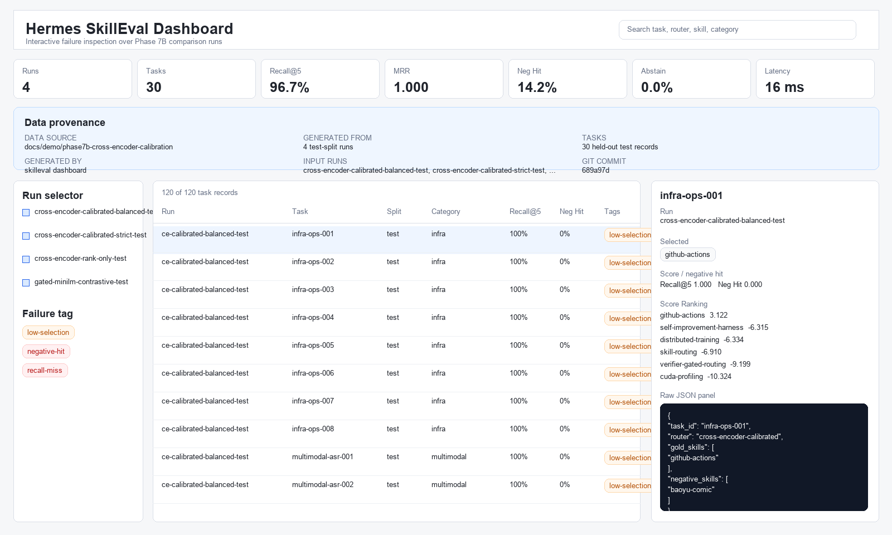
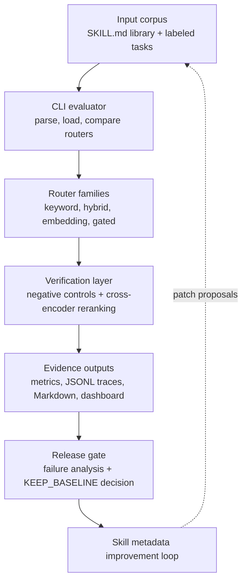
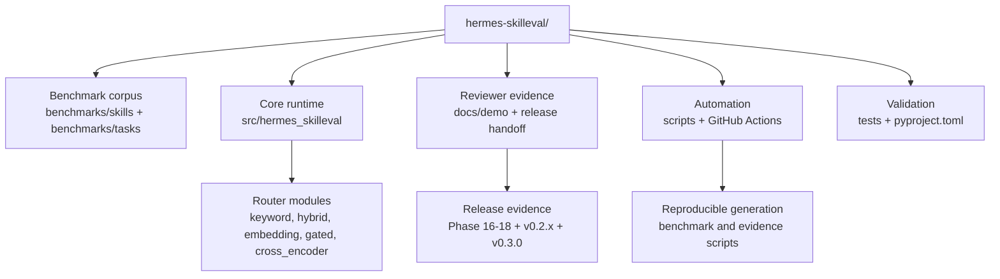

# Hermes SkillEval

[](https://www.python.org/downloads/)
[](https://github.com/Raidriar7170/hermes-skilleval/actions/workflows/validate.yml)
[](https://github.com/Raidriar7170/hermes-skilleval/releases/tag/v0.3.0)
[](tests)
[](action.yml)
[](LICENSE)
[](benchmarks)

**Evaluate, route, and regression-test agent skills before they break your coding agent.**

**Language / 语言:** [中文总览](#总览) · [English README](#what-it-does) · [中文完整说明](https://raidriar7170.github.io/hermes-skilleval/docs/interview-project-overview.html)

Hermes SkillEval helps maintainers of Claude Code, Codex, Cursor-style skill libraries, and MCP tool schemas detect wrong-skill activations, near-miss conflicts, and routing regressions in CI. It indexes `SKILL.md` libraries, runs labeled benchmark tasks with gold and negative skills, and writes reproducible JSON, Markdown, CI summary, and dashboard artifacts.

## 总览

Hermes SkillEval 是一个面向 AI 编程 Agent 技能库的离线评测和 CI 回归门禁项目。它关注的问题不是“哪个模型分数最高”，而是当 Claude Code、Codex、Cursor 这类 Agent 拥有越来越多相似技能时，系统能不能稳定选中正确技能，并且避免误触看起来相关但实际错误的技能。

这个项目做了三件事：先把 `SKILL.md` 技能库和带 gold / negative 标签的任务集变成可复现的评测数据；再对比 keyword、hybrid、embedding、gated、cross-encoder 等多类路由策略；最后把盲测结果、负样本风险、JSON/Markdown 证据、dashboard 和 GitHub Action 串成一个发布前检查流程。

最关键的一次结果是：`finetuned-embedding` 候选路由器虽然保留了 gold skill，但在盲测中新增选择了错误的 negative skill，所以 release gate 没有把它升级为默认路由器，而是继续保留 `baseline-minilm`。这也是项目想展示的核心能力：不仅能做评测，还能在候选方案看起来更“智能”但风险变高时拒绝上线。

当前完成度：`v0.3.0` 已发布，当前测试面为 `668` 个 pytest cases。v0.3.0 记录 Stage 2 real Codex pilot evidence-chain closeout；最终 evidence-gate posture 是 `REVIEW_REQUIRED / KEEP_BASELINE`，`blocking_failure_count=0`，剩余 caveat 是 `live_agent.overlap_status`。这不是 benchmark PASS、性能提升结论或 router promotion。更完整的中文项目说明见 [中文完整说明](https://raidriar7170.github.io/hermes-skilleval/docs/interview-project-overview.html)。

## What it does

- Scans skill libraries into a portable index with descriptions, trigger cues,
  source paths, and parser warnings.
- Evaluates keyword, hybrid, embedding, gated, and cross-encoder routing
  strategies against gold and negative labels.
- Runs a release gate that keeps `baseline-minilm` when blind validation finds
  a worse candidate, and records the decision as reviewable artifacts.
- Ships a published reusable repository Action for pull-request regression
  checks without a GitHub API token.

## Why skill routing is hard

Modern agent frameworks increasingly rely on external skill libraries. The
hard part is routing the right skill at the right time while avoiding tempting
negative skills that look semantically close.

| Scenario | Naive router | Hermes SkillEval |
|---|---|---|
| Similar skills in one category | Selects near-miss negatives | Measures negative hits and same-category confusion |
| Skill library grows over time | Regressions are hard to compare | Produces comparable JSONL and Markdown reports |
| Skill descriptions are weak | Manual patching is ad hoc | Proposes metadata patches and verifies before/after gains |
| Learned rerankers look promising | Trade-offs are easy to miss | Gates default promotion on blind validation evidence |

## Quick Start

```bash
git clone https://github.com/Raidriar7170/hermes-skilleval.git
cd hermes-skilleval
python -m venv .venv
source .venv/bin/activate
python -m pip install -e ".[dev]"

skilleval github-action-gate \
  --skill-path examples/github-action/skills \
  --benchmark-path examples/github-action/benchmark \
  --min-recall-at-k 1.0 \
  --max-negative-hit-rate 0.0 \
  --output-dir "${TMPDIR:-/tmp}/skilleval-gate"

pytest -q
```

Expected: the example gate returns `ALLOW_MERGE`, and the v0.3.0 release
validation records `668 passed` / `668 pytest cases`.

For full CLI usage, see [`docs/usage.md`](docs/usage.md). For reviewer
navigation across release, diagnostic, external validation, CI, OpenSpec, and
Human Brief evidence, see [`docs/evidence-map.md`](docs/evidence-map.md).

## Use as GitHub Action

Copy this into a consumer repository that owns its own `skills/` and
`benchmark/` folders:

```yaml
name: SkillEval Gate

on:
  pull_request:
  workflow_dispatch:

jobs:
  skilleval:
    runs-on: ubuntu-latest
    steps:
      - uses: actions/checkout@v4
      - uses: actions/setup-python@v5
        with:
          python-version: "3.11"
      - uses: Raidriar7170/hermes-skilleval@v0.3.0
        with:
          skill-path: skills
          benchmark-path: benchmark
          min-recall-at-k: "1.0"
          max-negative-hit-rate: "0.0"
          upload-artifacts: "true"
```

The Action runs `skilleval github-action-gate`, writes GitHub Actions step
summary content plus gate report, CI summary, and results artifacts, and does
not require a GitHub API token. It reports `ALLOW_MERGE` or `BLOCK_MERGE`; it
does not approve merges automatically.

The copy/paste fixture lives in
[`examples/github-action/`](examples/github-action/). A future external demo
repository plan is tracked in
[`docs/demo-repo-plan.md`](docs/demo-repo-plan.md) without claiming that
`Raidriar7170/hermes-skilleval-demo` already exists.

## Example failure caught

Phase 16 includes a concrete blind-validation case that explains why negative
controls matter:

| Field | Value |
|---|---|
| Blind task | `blind-claude-mcp-routing` |
| Gold skill | `mcp-tool-routing` |
| Tempting negative skill | `slash-command-workflow` |
| Baseline top-5 | Kept the gold skill and did not select the negative skill |
| Fine-tuned candidate top-5 | Kept the gold skill but newly selected the negative skill |
| Guard flags | `negative_hit_rate_increased`, `negative_accepted_rate_increased`, `new_negative_skill_selected` |
| Release result | Phase 17 records `KEEP_BASELINE`; Phase 18 reproduces the decision |

The exact diff is committed in
[`route-diffs.jsonl`](docs/demo/phase16-blind-validation/route-diffs.jsonl).

## Dashboard preview

### Live Dashboard

Explore the committed Phase 8 dashboard:
[`Open Hermes SkillEval Dashboard`](https://raidriar7170.github.io/hermes-skilleval/docs/demo/phase8-static-dashboard/dashboard.html).

The dashboard supports run filtering, failure inspection, score ranking, and
raw JSON audit over the Phase 7B comparison artifacts. The current published
release is the v0.3.0 Stage 2 real Codex pilot evidence-chain release, with the
dashboard remaining useful for earlier routing inspection.



## Evidence links

| Evidence | What it shows | Link |
|---|---|---|
| Phase 16 blind validation | `REVIEW_REQUIRED`; two regressions and worse negative-hit behavior | [`docs`](docs/phase16.md), [`comparison.md`](docs/demo/phase16-blind-validation/comparison.md) |
| Phase 17 release selector | `KEEP_BASELINE`; `baseline-minilm` remains default | [`docs`](docs/phase17.md), [`release-decision.json`](docs/demo/phase17-calibrated-release-selector/release-decision.json) |
| Phase 18 reproducibility pack | `PASS`; release-check reproduces the default-router decision | [`docs`](docs/phase18.md), [`release-manifest.json`](docs/demo/phase18-ci-release-reproducibility/release-manifest.json) |
| v0.2.0 historical pre-publish review | `NEEDS_REVIEW`, `Published: false`, and required human confirmation | [`release-decision.md`](docs/demo/v0.2.0-release-decision/release-decision.md), [`final checklist`](docs/demo/v0.2.0-final-approval/final-approval.md) |
| v0.2.0 post-release evidence | post-release facts after human GO: Published `true`; tag and GitHub Release created; Marketplace published `false` | [`post-release.md`](docs/demo/v0.2.0-post-release/post-release.md), [`post-release.json`](docs/demo/v0.2.0-post-release/post-release.json) |
| v0.2.1 patch release notes | post-release onboarding cleanup packaged as a conservative patch release | [`release notes`](docs/release-notes/v0.2.1.md), [`Human Brief`](docs/human-briefs/2026-06-05-post-release-onboarding-cleanup.html) |
| v0.3.0 release | Stage 2 real Codex pilot evidence-chain release; final posture `REVIEW_REQUIRED / KEEP_BASELINE` with `blocking_failure_count=0` | [`GitHub Release`](https://github.com/Raidriar7170/hermes-skilleval/releases/tag/v0.3.0), [`release prep PR`](https://github.com/Raidriar7170/hermes-skilleval/pull/31) |

v0.2.0 post-release status: Published: `true`; tag and GitHub Release created `true`;
Marketplace published `false`.

For the long evidence chain, start from
[`docs/release-handoff.md`](docs/release-handoff.md) and
[`docs/evidence-map.md`](docs/evidence-map.md). For concrete blocked-regression
and diagnostic-risk examples, use
[`docs/failure-gallery.md`](docs/failure-gallery.md). For a longer Chinese
project walkthrough, use
[中文完整说明](https://raidriar7170.github.io/hermes-skilleval/docs/interview-project-overview.html).

## Limitations / Boundaries

- This is a self-built Hermes-style benchmark, not a standard public benchmark,
  not a public ranking table, not a SOTA claim, and not a model-leadership claim.
- The strongest evidence is the evaluation, artifact, and release-gate
  workflow, not absolute model superiority or production readiness.
- `baseline-minilm` remains the default router; `finetuned-embedding` is not approved as default.

- This is a reusable repository Action, not a Marketplace-published Action, not a GitHub API PR comment bot, not a SaaS dashboard, and not a runtime MCP router.
- It is not GitHub API PR comments, not PR annotations, not release approval,
  not automatic merge approval, not automatic release publication, and not
  Marketplace publication.
- Model checkpoints, embedding caches, and private remote-machine details are
  intentionally not committed.

## Benchmark scale

| Item | Value |
|---|---:|
| Benchmark tasks | 80 |
| Hermes-style benchmark skills | 45 |
| Router families | 5 |
| Test cases | 668 |
| Remote hardware validation | Single idle A100 GPU |

## Architecture / 系统架构



Core design principles:

- **Offline-first:** default keyword, hybrid, and hashing embedding workflows
  run without network access, Hermes Agent, or LLM API keys.
- **Verifier-aware:** reports track both gold skill recall and negative skill
  hits, so a router cannot hide unsafe selections behind high recall.
- **Failure-driven:** the harness turns missed gold skills and negative hits into concrete metadata patch proposals.
- **Extensible:** optional `sentence-transformers` and cross-encoder backends plug into the same evaluation surface.

---

## Project Structure / 项目结构



## Experiment Timeline / 实验演进

For the full phase-by-phase experiment history, see
[`docs/experiment-timeline.md`](docs/experiment-timeline.md). The README keeps
the current problem, release evidence, dashboard preview, commands, and
architecture on the front door.

---

## Technical Details / 技术细节

### 1. Skill Parsing and Indexing

`skill_parser.py` discovers `skills/**/SKILL.md`, reads YAML frontmatter,
infers categories from paths, extracts trigger terms, estimates token counts,
and writes a portable JSON skill index.

### 2. Router Families

| Router | Role |
|---|---|
| `keyword` | Deterministic lexical baseline |
| `hybrid` | Lexical retrieval with category and explicit skill-id boosts |
| `embedding` | Hashing baseline or real `sentence-transformers` embedding retriever |
| `gated` | Verification-gated reranker with confidence and contrastive selective logic |
| `cross-encoder` | Learned pairwise reranker over embedding candidates |

### 3. Verification and Negative Controls

The benchmark includes both `gold_skills` and `negative_skills`. Reports track:

- `Recall@1`, `Recall@3`, `Recall@5`
- `Precision@5`
- `MRR`
- `NDCG@5`
- `Negative Hit Rate`
- selective accepted-output metrics
- per-task score traces and latency

### 4. Self-Improvement Harness

`improve-skills` proposes deterministic metadata patches from observed misses
and negative hits. `judge-improvement` compares before/after runs and writes an
acceptance report, turning routing failures into measurable skill-library edits.

### 5. A100 Deployment

Phase 7A staged MiniLM embedding and MS MARCO MiniLM cross-encoder models under
the user-owned remote path, selected an idle A100 with `CUDA_VISIBLE_DEVICES=3`,
and validated learned reranking on the full 80-task benchmark. Phase 7B then
fitted dev-split cross-encoder acceptance thresholds and evaluated the frozen
policies on the held-out test split. See [`docs/phase7a.md`](docs/phase7a.md)
and [`docs/phase7b.md`](docs/phase7b.md).

---

## Tech Stack / 技术栈

| Component | Technology | Purpose |
|---|---|---|
| Core Runtime | Python 3.11 | CLI and benchmark harness |
| CLI | argparse | `skilleval` command suite |
| Data Models | dataclasses + PyYAML | Skill and task schemas |
| Retrieval | keyword, hybrid, hashing embeddings | Offline deterministic baselines |
| Neural Retrieval | sentence-transformers MiniLM | Real embedding router |
| Reranking | verification gate + cross-encoder | Selective and learned ranking |
| Reports | JSONL + Markdown + static HTML dashboard | Reproducible experiment artifacts |
| Testing | pytest | 668 pytest cases |
| Hardware | Mac + A100 dev machine | Local development and remote model validation |

---

## Roadmap

- [x] Hermes-style `SKILL.md` parser and skill indexer
- [x] 80-task / 45-skill benchmark corpus with negative labels
- [x] Keyword, hybrid, hashing embedding, and real embedding routers
- [x] Verification-gated reranker and selective acceptance
- [x] Failure analysis reports and self-improvement acceptance gate
- [x] Contrastive gating for same-category ambiguous negatives
- [x] Cross-encoder reranker deployed on a single idle A100
- [x] Calibrated cross-encoder acceptance thresholds
- [x] Web dashboard for interactive failure inspection
- [x] Real skill-library migration test protocol
      ([docs](docs/phase9.md), [protocol](docs/skill-library-migration-protocol.md))
- [x] Agent-in-the-loop skill routing evaluation
      ([docs](docs/phase10.md), [demo](docs/demo/phase10-agent-in-the-loop/dashboard.html))
- [x] Evidence judge calibration for agent-loop traces
      ([docs](docs/phase11.md), [demo](docs/demo/phase11-evidence-judge-calibration/dashboard.html))
- [x] Offline skill metadata patch ranking
      ([docs](docs/phase12.md), [demo](docs/demo/phase12-skill-patch-ranking/ranked-patches.md))
- [x] Patch simulation regression guard
      ([docs](docs/phase13.md), [demo](docs/demo/phase13-patch-simulation/regression-report.md))
- [x] Fine-tuned embedding router for domain-specific skill libraries
      ([docs](docs/phase14.md), [training data](docs/demo/phase14-finetuned-embedding-router/training-summary.json))
- [x] Held-out fine-tuned provenance pack
      ([docs](docs/phase15.md), [demo](docs/demo/phase15-held-out-generalization/provenance.md))
- [x] Blind validation and release handoff gate
      ([docs](docs/phase16.md), [handoff](docs/release-handoff.md))
- [x] Calibrated default-router release selector
      ([docs](docs/phase17.md), [decision](docs/demo/phase17-calibrated-release-selector/release-decision.json))
- [x] CI-backed release reproducibility pack
      ([docs](docs/phase18.md), [manifest](docs/demo/phase18-ci-release-reproducibility/release-manifest.json))

---

## License

MIT License. See [LICENSE](LICENSE) for details.

---

## Project Summary / 项目总结

> **For recruiters and hiring managers:**
>
> Hermes SkillEval demonstrates end-to-end agent evaluation engineering:
>
> - **Agent Systems:** designed a benchmark harness for Hermes-style skill
>   routing, including parsing, indexing, routing, reporting, and
>   failure-driven improvement.
> - **Retrieval and Ranking:** implemented keyword, hybrid, embedding,
>   verification-gated, contrastive, and cross-encoder routing strategies.
> - **ML Evaluation:** built an 80-task benchmark with negative controls and
>   ranking metrics such as Recall@k, MRR, NDCG, and Negative Hit Rate.
> - **Infrastructure:** validated neural reranking on shared A100 infrastructure
>   while selecting idle GPUs and preserving user-owned storage paths.
> - **Engineering Quality:** shipped a typed Python CLI with 668 passing tests,
>   reproducible benchmark artifacts, a static inspection dashboard, and a
>   release gate that keeps `baseline-minilm` when blind validation finds a
>   fine-tuned-router regression.
>
> **面向招聘者:**
>
> 这个项目展示了 Agent Skill 路由评测、检索排序、失败分析、自改进闭环
> 和远端 GPU 部署能力。它不是一个单纯 demo，而是从 benchmark 构建、
> router 设计、metric 评估、cross-encoder 验证到简历材料整理的一套
> 完整工程闭环。
