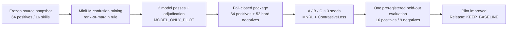
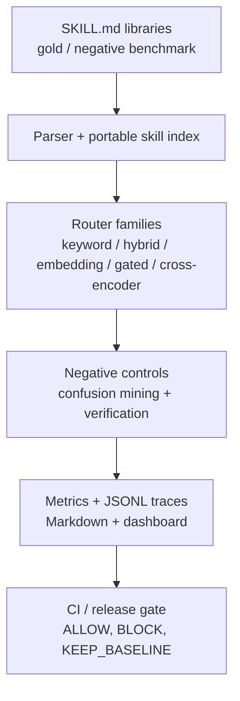

<p align="right">
  <a href="./README.md"></a>
  <a href="./README_EN.md"></a>
</p>

# Hermes SkillEval

[](https://www.python.org/downloads/)
[](https://github.com/Raidriar7170/hermes-skilleval/actions/workflows/validate.yml)
[](https://github.com/Raidriar7170/hermes-skilleval/releases/tag/v0.3.0)
[](action.yml)
[](benchmarks)
[](LICENSE)

**Skill-routing evaluation, hard-negative training, and release gates for AI coding agents.**

Hermes SkillEval addresses a concrete problem: as Claude Code, Codex, Cursor-style
agents accumulate similar `SKILL.md` capabilities, how can they select the correct
skill, identify semantically related but role-incompatible near misses, and stop a
routing regression before it becomes the default?

[30-second overview](#understand-the-project-in-30-seconds) ·
[Core implementation](#what-i-built) · [Router V2](#how-router-v2-was-trained) ·
[Results](#key-quantitative-results) · [Limitations](#limitations-first) ·
[Quick start](#quick-start) · [Evidence](#evidence-and-reproduction)

## Understand the project in 30 seconds

| Recruiter question | Answer |
|---|---|
| What problem does it solve? | It evaluates agent-skill routing accuracy and negative-skill risk, diagnoses near-miss confusion, and uses CI / release gates to stop risky candidates from being promoted. |
| What did I build? | A `SKILL.md` parser and index, gold/negative-labeled benchmarks, five router families, confusion mining, hard-negative review and packaging, SentenceTransformer training, paired evaluation, evidence lineage, and a reusable GitHub Action. |
| How was Router V2 trained? | Starting from a frozen MiniLM model, it used 64 positives and 52 reviewed hard negatives. Positives used `MultipleNegativesRankingLoss`; hard negatives used `ContrastiveLoss`, with three arms, three random seeds, and preregistered gates. |
| What were the results? | Arm A → C Recall@1 improved from `12/16` to `16/16`; Recall@5 stayed at `16/16`; Negative Hit Rate@1 dropped from `1/9` to `0/9`; and Negative Hit Rate@5 fell from `24/27` to `18/27` across three paired runs. |
| What is the final decision? | The internal pilot conclusion remains `ROUTER_V2_PILOT_IMPROVED`. The later Run 003 completed two rounds of Agent-only candidate construction but selected only `87/128` qualifying tasks (`85` negative-labeled and `2` positive-only), so it stopped at `AGENT_BLIND_V2_DATASET_INSUFFICIENT / KEEP_BASELINE`. No Commit B, Arm A/C scoring, or blind-v2 gate result exists. |

## Key quantitative results

Router V2 pilot-002 reused the exact frozen A/B/C model snapshots from pilot-001,
performed no retraining, and completed the single preregistered held-out evaluation
attempt. The decision comparison was paired Arm A versus Arm C:

| Metric | Arm A: frozen base model | Arm C: positives + confusion hard negatives | Outcome |
|---|---:|---:|---|
| Recall@1 | `12/16` | `16/16` | Four additional top-1 hits in every seed |
| Recall@5 | `16/16` | `16/16` | Preserved |
| MRR | `0.859375` | `1.000000` | `+0.140625` |
| NDCG@5 | `0.895217` | `1.000000` | `+0.104783` |
| Negative Hit Rate@1 | `1/9` | `0/9` | Removed the top-1 negative hit in every seed |
| Negative Hit Rate@5 | `8/9` | `6/9`, `7/9`, `5/9` | `24/27 → 18/27` across three seeds |
| p95 latency ratio | — | mean `0.950814` | Every seed remained below the `1.20` gate |

The preregistered Recall@5, MRR, NDCG@5, Negative Hit Rate@5, and p95 latency
gates all passed, producing `ROUTER_V2_PILOT_IMPROVED`. See the
[pilot-002 result report](artifacts/router-v2-v4/internal-training-pilot/router-v2-v4-confusion-mined-pilot-002-eval-replay/result-report.md)
for per-seed metrics, paired wins/losses, failure slices, and lineage.

## Limitations first

- This is a `MODEL_ONLY_PILOT`: `human_reviewer_count=0`,
  `independent_human_review=false`, and `model_correlation_risk=true`. Two model
  review passes plus model adjudication are not independent human labeling.
- Final evaluation covers only 16 held-out positive tasks and 9 supported
  negative labels. This is a self-built Hermes-style benchmark, not a public
  standard benchmark, leaderboard, or SOTA result.
- Arm C improved top-1 metrics, but each seed still had `5–7/9` Negative Hit@5
  cases and `7/16` tasks with at least one diagnostic flag. The confusion problem
  is not solved.
- Pilot-002 used one preregistered attempt with no best-seed selection, rerun, or
  post-hoc tuning. The later Run 003 used fixed Generator `gpt-5.6-sol/max`,
  Reviewer A `gpt-5.6-sol/ultra`, and Reviewer B `gpt-5.6-luna/max`
  configurations. Two rounds produced `512` candidates; contamination checks
  recorded `398 PASS / 114 REJECT`, three-way gold agreement was `396`, exact
  gold-plus-negative agreement was `99`, and frozen selection retained `87`.
  That was insufficient for `128 tasks / 96 negatives / 128 families`, so the
  workflow did not lower quotas and stopped before Commit B, Arm A/C loading,
  model scoring, or the formal attempt. All three roles are OpenAI Agents;
  role isolation is neither statistical independence nor human review.
- The frozen canonical pilot manifest omitted four model-only truth fields. The
  repository preserves that manifest and adds a self-sealed
  [`truth-erratum.json`](artifacts/router-v2-v4/internal-training-pilot/router-v2-v4-confusion-mined-pilot-002-eval-replay/truth-erratum.json)
  instead of rewriting history.
- Model checkpoints, embedding caches, and private remote-machine details are not
  committed. This is not a SaaS product, runtime MCP router, automatic merge or
  release system, or Marketplace publication.

## What I built

| Module | Core implementation | Code and evidence |
|---|---|---|
| Skill corpus and evaluation contracts | Parses YAML frontmatter and `SKILL.md` bodies into a portable skill index; loads gold / negative labels and emits reproducible metrics and reports. | [`skill_parser.py`](src/hermes_skilleval/skill_parser.py), [`skill_index.py`](src/hermes_skilleval/skill_index.py), [`metrics.py`](src/hermes_skilleval/metrics.py) |
| Multi-strategy retrieval and ranking | Implements keyword, hybrid, embedding, verification-gated, and cross-encoder routers behind a shared evaluation surface. | [`routers/`](src/hermes_skilleval/routers), [`comparison.py`](src/hermes_skilleval/comparison.py) |
| Router V2 data and confusion mining | Defines a prompt-only query contract, frozen source snapshot, MiniLM baseline-confusion mining, two isolated model reviews plus adjudication, and fail-closed admission. | [`router_query.py`](src/hermes_skilleval/router_query.py), [`router_v2_reviewed_source.py`](src/hermes_skilleval/router_v2_reviewed_source.py), [`router_v2_model_review.py`](src/hermes_skilleval/router_v2_model_review.py) |
| Hard-negative training pipeline | Builds the 64-positive + 52-hard-negative internal package, skill-unique deterministic sampler, MNRL + ContrastiveLoss training loop, and model lineage manifests. | [`router_v2_internal_package.py`](src/hermes_skilleval/router_v2_internal_package.py), [`router_v2_training_pilot.py`](src/hermes_skilleval/router_v2_training_pilot.py), [`train_embedding_router.py`](scripts/train_embedding_router.py) |
| Preregistered evaluation and release gates | Implements three-seed paired evaluation, attempt ledgers, aggregate metrics, failure slices, artifact-hash audits, the release selector, and a reusable GitHub Action gate. | [`router_v2_pilot_evaluation_runner.py`](src/hermes_skilleval/router_v2_pilot_evaluation_runner.py), [`release_selector.py`](src/hermes_skilleval/release_selector.py), [`github_action_gate.py`](src/hermes_skilleval/github_action_gate.py) |

## How Router V2 was trained

### Data and review

- Frozen base model: `sentence-transformers/all-MiniLM-L6-v2` at revision
  `1110a243fdf4706b3f48f1d95db1a4f5529b4d41`.
- Training input: 64 train positives + 52 admitted hard negatives, 116 pairs total.
- Confusion mining: a single-threaded CPU baseline over the frozen 16-skill index;
  candidates had to satisfy `rank <= 5` or
  `gold_score - candidate_score <= 0.05` before review.
- Review: newly mined candidates passed through two isolated model passes and one
  model adjudication. Disputed, ambiguous, unsupported, easy-negative, and
  held-out rows were excluded from training.
- Isolation: held-out labels were sealed before training and never entered mining,
  sampling, training, or hyperparameter decisions.

### Training configuration

| Item | Configuration |
|---|---|
| Arm A | Frozen Base MiniLM, evaluation only |
| Arm B | Positive-only Router V2; explanatory, not part of the decision gate |
| Arm C | Positives + admitted baseline-confusion hard negatives |
| Positive objective | `MultipleNegativesRankingLoss` |
| Hard-negative objective | `ContrastiveLoss(margin=1.5)` |
| Sampler | `skill-unique-v1`; at most one example per skill in an MNRL batch |
| Seeds | `7170`, `7171`, `7172` |
| Hyperparameters | 3 epochs, batch size 16, AdamW, learning rate `2e-5` |
| Decision comparison | Paired Arm C vs Arm A only; Arm B is explanatory |



## Why the release gate matters

The project does not report Recall in isolation. Phase 16 blind validation caught
a concrete regression: a fine-tuned candidate retained the gold skill but newly
selected a wrong negative skill.

| Field | Evidence |
|---|---|
| Blind task | `blind-claude-mcp-routing` |
| Gold skill | `mcp-tool-routing` |
| Tempting negative | `slash-command-workflow` |
| Baseline top-5 | Kept the gold skill and did not select the negative |
| Fine-tuned top-5 | Kept the gold skill but newly selected the negative |
| Release result | Phase 17 recorded `KEEP_BASELINE`; Phase 18 reproduced it |

The exact route diff is committed in
[`route-diffs.jsonl`](docs/demo/phase16-blind-validation/route-diffs.jsonl).
The goal is not to rationalize an improvement; it is to make promotion impossible
when evidence is insufficient or negative-skill risk worsens.

## Quick Start

```bash
git clone https://github.com/Raidriar7170/hermes-skilleval.git
cd hermes-skilleval
python -m venv .venv
source .venv/bin/activate
python -m pip install -e ".[dev]"

skilleval github-action-gate \
  --skill-path examples/github-action/skills \
  --benchmark-path examples/github-action/benchmark \
  --min-recall-at-k 1.0 \
  --max-negative-hit-rate 0.0 \
  --output-dir "${TMPDIR:-/tmp}/skilleval-gate"

pytest -q
```

The example gate is expected to return `ALLOW_MERGE`. See
[`docs/usage.md`](docs/usage.md) for the complete CLI reference.

## Use as a GitHub Action

The consumer repository only needs its own `skills/` and `benchmark/` folders:

```yaml
name: SkillEval Gate

on:
  pull_request:
  workflow_dispatch:

jobs:
  skilleval:
    runs-on: ubuntu-latest
    steps:
      - uses: actions/checkout@v4
      - uses: actions/setup-python@v5
        with:
          python-version: "3.11"
      - uses: Raidriar7170/hermes-skilleval@v0.3.0
        with:
          skill-path: skills
          benchmark-path: benchmark
          min-recall-at-k: "1.0"
          max-negative-hit-rate: "0.0"
          upload-artifacts: "true"
```

The Action runs `skilleval github-action-gate` and writes a GitHub Actions step
summary, gate report, CI summary, and result artifacts without a GitHub API token.
It reports `ALLOW_MERGE` or `BLOCK_MERGE`; it does not approve or merge PRs.

## Architecture



Core principles:

- **Offline-first:** keyword, hybrid, and hashing-embedding paths require no LLM API.
- **Negative-aware:** Recall and Negative Hit Rate both enter reports and gates.
- **Evidence-first:** key artifacts bind source hashes, config, seeds, model lineage,
  and attempt state instead of retaining only final scores.
- **Fail-closed:** incomplete data, model, held-out, or gate contracts stop the run
  instead of silently falling back to defaults.

### Dashboard

The committed [static dashboard](https://raidriar7170.github.io/hermes-skilleval/docs/demo/phase8-static-dashboard/dashboard.html)
supports run filtering, failure inspection, ranking review, and raw JSON evidence.


## Project scale and tech stack

| Item | Current scope |
|---|---|
| General benchmark | 80 tasks / 45 Hermes-style skills |
| Router families | keyword, hybrid, embedding, gated, cross-encoder |
| Router V2 pilot | 16 frozen skills, 64 train positives, 52 admitted hard negatives |
| Router V2 evaluation | 16 held-out positives, 9 supported negatives, 3 seeds |
| Runtime | Python 3.11, argparse, dataclasses, PyYAML |
| ML | sentence-transformers MiniLM, MNRL, ContrastiveLoss, cross-encoder |
| Evidence outputs | JSON / JSONL, Markdown, GitHub Actions summary, static HTML dashboard |
| Verification | pytest, GitHub Actions, hash-bound manifests, release checks |

## Evidence and reproduction

| Evidence | What it establishes |
|---|---|
| [Router V2 pilot-002 result report](artifacts/router-v2-v4/internal-training-pilot/router-v2-v4-confusion-mined-pilot-002-eval-replay/result-report.md) | Raw counts, per-seed metrics, gates, paired wins/losses, failure slices, and lineage |
| [Router V2 evaluation summary](artifacts/router-v2-v4/internal-training-pilot/router-v2-v4-confusion-mined-pilot-002-eval-replay/evaluation/attempt-1/artifacts/evaluation-summary.json) | Machine-readable `ROUTER_V2_PILOT_IMPROVED / KEEP_BASELINE` truth surface |
| [Router V2 data manifest](artifacts/router-v2-v4/internal-training-pilot/router-v2-v4-confusion-mined-pilot-001/package/router-v2-v4-internal-training-package-001/data-manifest.json) | 64 positives, 52 hard negatives, exclusions, and review truth block |
| [Phase 16 blind validation](docs/demo/phase16-blind-validation/comparison.md) | Counterexample where a candidate introduced a negative hit |
| [Phase 17 release decision](docs/demo/phase17-calibrated-release-selector/release-decision.json) | `baseline-minilm` remains the default |
| [Phase 18 reproducibility manifest](docs/demo/phase18-ci-release-reproducibility/release-manifest.json) | CI-backed decision reproduction |
| [Evidence map](docs/evidence-map.md) | Navigation across release, diagnostics, external validation, CI, and Human Brief evidence |
| [Detailed Chinese project guide](https://raidriar7170.github.io/hermes-skilleval/docs/interview-project-overview.html) | Interview-oriented long-form project explanation |

## Release status and boundaries

`v0.3.0` is the current published release and records the Stage 2 real Codex pilot
evidence-chain closeout. Its final posture is `REVIEW_REQUIRED / KEEP_BASELINE`,
not a benchmark PASS, performance-improvement result, or router promotion. Router
V2 pilot-002 is later internal evidence; it is not part of v0.3.0 and does not
change the default router.

See [`docs/experiment-timeline.md`](docs/experiment-timeline.md) for the historical
experiment chain and [`docs/release-notes/v0.3.0.md`](docs/release-notes/v0.3.0.md)
for the current release notes.

## License

MIT License. See [LICENSE](LICENSE).
