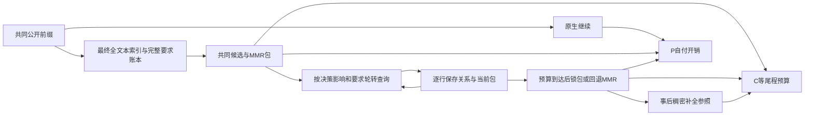

# 预算内来源关系选择

A优先检查当前MMR、保守最优集合和乐观竞争集合中的未知关系，每第三个位置按要求覆盖轮转。查询优先级使用固定要求权重、上下界宽度、集合成员关系和已观察批次的输入长度/时间估计。它是启发式，不是校准的信息价值。

所有公开要求始终进入目标。最多24个候选、4单元、1200token；A/D用同一枚举求解器及相同F系数。未分析、传输缺失、语义未知和拒绝均不获得正覆盖，但上界保留1。正关系和明确零关系固定为模型提议对应的值。上下界不包含模型判断错误，不是置信区间。

每批更新F下界，只有存在正关系且严格优于同矩阵下的MMR才交付临时关系包；否则保留MMR。停止不要求补全矩阵。已接受行不能重抽，截止后的结果不能回流改变锁定包。当前包和累计耗时可恢复；无法证明旧成本时只保留未知。

P把各方法真实在线费用从600秒共同预算中扣除，物理共享准备仍按每方法/重复计费；C给相同尾程预算并另列准备成本。D只是同矩阵事后补全，缺失不阻断P。功能只由独立目标和保护回归决定。机制分数、同包和回退成功都不能替代功能收益。

正式两状态 A 均因辅助调用截止停止并回退 MMR；P 的 N/M/A 与 C 的 M/A 均为每机制 2/2 通过，D 部分矩阵导致4个C格未运行。没有建立独立功能或关系获取效率收益；完整计数与预算边界见 results.md。
