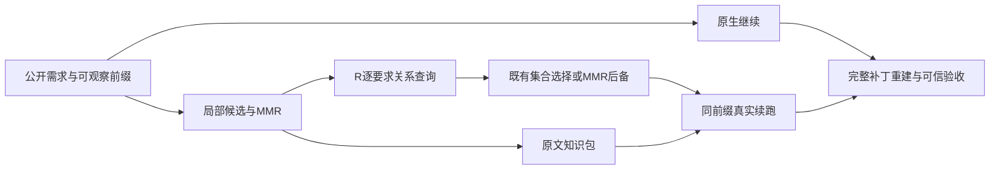

# N/MMR/R 真实功能对照与阶段收束

本轮完成4个前缀、24条真实尾程及8条独立R获取。原始功能结果为N 6/8、M 8/8、R 8/8通过；R相对M没有功能差异。四个机制均为探索性复用，共享公开前缀的重复不构成24个独立问题。

**关键限制：**共同候选准备之前的checkpoint验证漏计且没有可恢复的原始测量。初版前缀/获取完整保留，尾程启动前已修复后续准备计时；全部M/R预算合法性仍为UNKNOWN_PREPARATION_COST，不能把原始功能差异称为严格600秒自付成本下的增益。未通过重抽任务、重跑R或补造旧耗时弥补缺口。

实际状态：`integration=PARTIAL`，`functional_comparison=COMPLETE`；对M增益 `UNKNOWN`，对N增益 `UNKNOWN`。

## 表一：功能主表

| 机制 | 臂 | PASS | FAIL | UNKNOWN | 计划 | 预算有效/协议偏差 |
|---|---|---:|---:|---:|---:|---|
| python-identifier-validation | N | 2 | 0 | 0 | 2 | 2/2; VALID |
| python-identifier-validation | M | 2 | 0 | 0 | 2 | 0/2; UNKNOWN_PREPARATION_COST |
| python-identifier-validation | R | 2 | 0 | 0 | 2 | 0/2; UNKNOWN_PREPARATION_COST |
| filter-attribute-forwarding | N | 2 | 0 | 0 | 2 | 2/2; VALID |
| filter-attribute-forwarding | M | 2 | 0 | 0 | 2 | 0/2; UNKNOWN_PREPARATION_COST |
| filter-attribute-forwarding | R | 2 | 0 | 0 | 2 | 0/2; UNKNOWN_PREPARATION_COST |
| variable-file-cache | N | 2 | 0 | 0 | 2 | 2/2; VALID |
| variable-file-cache | M | 2 | 0 | 0 | 2 | 0/2; UNKNOWN_PREPARATION_COST |
| variable-file-cache | R | 2 | 0 | 0 | 2 | 0/2; UNKNOWN_PREPARATION_COST |
| invalid-host-field-errors | N | 0 | 2 | 0 | 2 | 2/2; VALID |
| invalid-host-field-errors | M | 2 | 0 | 0 | 2 | 0/2; UNKNOWN_PREPARATION_COST |
| invalid-host-field-errors | R | 2 | 0 | 0 | 2 | 0/2; UNKNOWN_PREPARATION_COST |

R_minus_M：任务等权原始均值差 0.00；胜/负/平/未知 {'WIN': 0, 'LOSS': 0, 'TIE': 4, 'UNKNOWN': 0}；未知下界/上界 [0.0, 0.0]。预算协议支持增益声明：False。

R_minus_N：任务等权原始均值差 0.25；胜/负/平/未知 {'WIN': 1, 'LOSS': 0, 'TIE': 3, 'UNKNOWN': 0}；未知下界/上界 [0.25, 0.25]。预算协议支持增益声明：False。

标签来自完整原候选在干净base上的可信目标与保护检查。文件policy、预算与注入状态不改写功能标签。4个机制只支持原始计数，不报告总体显著性或因果唯一性。

## 表二：实际干预与费用

| 机制/臂/重复 | 前缀秒 | 共同准备秒 | R获取秒 | 已计准备秒 | 尾程可用秒 | 实际含准备秒 | 单元/tokens | 同MMR | 注入观察 | 后备原因 | 预算状态 |
|---|---:|---:|---:|---:|---:|---:|---|---|---|---|---|
| python-identifier-validation/M/1 | 33.55 | 8.77 | N/A | 9.57 | 556.88 | 92.33 | 4/955 | N/A | True | — | UNKNOWN_PREPARATION_COST |
| python-identifier-validation/R/1 | 33.55 | 8.77 | 37.35 | 47.74 | 518.71 | 166.54 | 3/648 | False | True | — | UNKNOWN_PREPARATION_COST |
| python-identifier-validation/N/1 | 33.55 | 0 | N/A | 0.35 | 566.10 | 109.61 | 0/0 | N/A | N/A | — | VALID |
| python-identifier-validation/M/2 | 33.55 | 8.77 | N/A | 9.49 | 556.96 | 109.52 | 4/955 | N/A | True | — | UNKNOWN_PREPARATION_COST |
| python-identifier-validation/N/2 | 33.55 | 0 | N/A | 0.75 | 565.70 | 161.85 | 0/0 | N/A | N/A | — | VALID |
| python-identifier-validation/R/2 | 33.55 | 8.77 | 44.34 | 55.03 | 511.43 | 169.18 | 3/648 | False | True | — | UNKNOWN_PREPARATION_COST |
| filter-attribute-forwarding/N/1 | 47.20 | 0 | N/A | 0.75 | 552.05 | 64.17 | 0/0 | N/A | N/A | — | VALID |
| filter-attribute-forwarding/R/1 | 47.20 | 3.20 | 42.15 | 46.69 | 506.11 | 130.47 | 4/834 | True | True | NO_AFFORDABLE_BATCH | UNKNOWN_PREPARATION_COST |
| filter-attribute-forwarding/M/1 | 47.20 | 3.20 | N/A | 3.90 | 548.91 | 51.81 | 4/834 | N/A | True | — | UNKNOWN_PREPARATION_COST |
| filter-attribute-forwarding/N/2 | 47.20 | 0 | N/A | 0.71 | 552.09 | 42.31 | 0/0 | N/A | N/A | — | VALID |
| filter-attribute-forwarding/R/2 | 47.20 | 3.20 | 36.56 | 41.58 | 511.22 | 115.68 | 4/834 | True | True | NO_AFFORDABLE_BATCH | UNKNOWN_PREPARATION_COST |
| filter-attribute-forwarding/M/2 | 47.20 | 3.20 | N/A | 3.94 | 548.87 | 45.88 | 4/834 | N/A | True | — | UNKNOWN_PREPARATION_COST |
| variable-file-cache/N/1 | 71.30 | 0 | N/A | 0.84 | 527.86 | 94.77 | 0/0 | N/A | N/A | — | VALID |
| variable-file-cache/M/1 | 71.30 | 3.50 | N/A | 4.29 | 524.41 | 93.21 | 3/1199 | N/A | True | — | UNKNOWN_PREPARATION_COST |
| variable-file-cache/R/1 | 71.30 | 3.50 | 42.21 | 47.88 | 480.82 | 129.07 | 2/1045 | False | True | — | UNKNOWN_PREPARATION_COST |
| variable-file-cache/N/2 | 71.30 | 0 | N/A | 0.78 | 527.92 | 50.76 | 0/0 | N/A | N/A | — | VALID |
| variable-file-cache/R/2 | 71.30 | 3.50 | 40.59 | 46.09 | 482.61 | 93.34 | 2/1045 | False | True | — | UNKNOWN_PREPARATION_COST |
| variable-file-cache/M/2 | 71.30 | 3.50 | N/A | 4.28 | 524.41 | 112.68 | 3/1199 | N/A | True | — | UNKNOWN_PREPARATION_COST |
| invalid-host-field-errors/M/1 | 27.08 | 4.08 | N/A | 4.85 | 568.07 | 229.24 | 2/1108 | N/A | True | — | UNKNOWN_PREPARATION_COST |
| invalid-host-field-errors/N/1 | 27.08 | 0 | N/A | 0.83 | 572.08 | 167.51 | 0/0 | N/A | N/A | — | VALID |
| invalid-host-field-errors/R/1 | 27.08 | 4.08 | 41.38 | 47.67 | 525.24 | 265.44 | 3/1024 | False | True | — | UNKNOWN_PREPARATION_COST |
| invalid-host-field-errors/M/2 | 27.08 | 4.08 | N/A | 4.83 | 568.08 | 214.56 | 2/1108 | N/A | True | — | UNKNOWN_PREPARATION_COST |
| invalid-host-field-errors/N/2 | 27.08 | 0 | N/A | 0.79 | 572.13 | 163.23 | 0/0 | N/A | N/A | — | VALID |
| invalid-host-field-errors/R/2 | 27.08 | 4.08 | 36.91 | 43.11 | 529.81 | 250.84 | 2/811 | False | True | — | UNKNOWN_PREPARATION_COST |

N/A表示该臂不适用，并非缺失测量；“实际含准备秒”不含单列的公共前缀。准备费包含共同检索/MMR、R自己的编码/配对特征/关系获取和尾程公共准备；共享物理计算按同一实测费记入各对应重复。原共同checkpoint验证未知费用没有填零，表中数值仅为已计组件。R后备保留全部费用。离线索引另列于asset-summary.json；服务等待属于方法费，金额无账单依据。

## 表三：知识—行为案例

| 机制 | M/R原文与角色 | 后续可观察改动 | 验收原始结果 |
|---|---|---|---|
| python-identifier-validation/M1：统一Python标识符判断及关键字/类型边界 | documented_contract, existing_behavior；docs/docsite/rst/dev_guide/developing_python_3.rst; docs/docsite/rst/user_guide/playbooks_variables.rst; lib/ansible/plugins/lookup/password.py; lib/ansible/utils/vars.py；already_visible_in_prefix, not_observed_in_visible_prefix；原文及包引用见[逐格证据](../../../artifacts/repair-knowledge-functional-closeout-v1/knowledge-behavior.json) | lib/ansible/utils/vars.py; test/units/utils/test_vars.py | PASS |
| python-identifier-validation/R1：统一Python标识符判断及关键字/类型边界 | documented_contract, existing_behavior；docs/docsite/rst/dev_guide/developing_python_3.rst; docs/docsite/rst/user_guide/playbooks_variables.rst; lib/ansible/utils/vars.py；already_visible_in_prefix, not_observed_in_visible_prefix；原文及包引用见[逐格证据](../../../artifacts/repair-knowledge-functional-closeout-v1/knowledge-behavior.json) | lib/ansible/utils/vars.py; test/units/utils/test_vars.py | PASS |
| python-identifier-validation/M2：统一Python标识符判断及关键字/类型边界 | documented_contract, existing_behavior；docs/docsite/rst/dev_guide/developing_python_3.rst; docs/docsite/rst/user_guide/playbooks_variables.rst; lib/ansible/plugins/lookup/password.py; lib/ansible/utils/vars.py；already_visible_in_prefix, not_observed_in_visible_prefix；原文及包引用见[逐格证据](../../../artifacts/repair-knowledge-functional-closeout-v1/knowledge-behavior.json) | lib/ansible/utils/vars.py; test/units/utils/test_vars.py | PASS |
| python-identifier-validation/R2：统一Python标识符判断及关键字/类型边界 | documented_contract, existing_behavior；docs/docsite/rst/dev_guide/developing_python_3.rst; docs/docsite/rst/user_guide/playbooks_variables.rst; lib/ansible/utils/vars.py；already_visible_in_prefix, not_observed_in_visible_prefix；原文及包引用见[逐格证据](../../../artifacts/repair-knowledge-functional-closeout-v1/knowledge-behavior.json) | lib/ansible/utils/vars.py; test/units/utils/test_vars.py | PASS |
| filter-attribute-forwarding/R1：min/max传递attribute等参数，并保留旧环境后备行为 | documented_contract, existing_behavior；lib/ansible/plugins/filter/mathstuff.py；already_visible_in_prefix, not_observed_in_visible_prefix；原文及包引用见[逐格证据](../../../artifacts/repair-knowledge-functional-closeout-v1/knowledge-behavior.json) | lib/ansible/plugins/filter/mathstuff.py; test/units/plugins/filter/test_mathstuff.py | PASS |
| filter-attribute-forwarding/M1：min/max传递attribute等参数，并保留旧环境后备行为 | documented_contract, existing_behavior；lib/ansible/plugins/filter/mathstuff.py；already_visible_in_prefix, not_observed_in_visible_prefix；原文及包引用见[逐格证据](../../../artifacts/repair-knowledge-functional-closeout-v1/knowledge-behavior.json) | lib/ansible/plugins/filter/mathstuff.py; test/units/plugins/filter/test_mathstuff.py | PASS |
| filter-attribute-forwarding/R2：min/max传递attribute等参数，并保留旧环境后备行为 | documented_contract, existing_behavior；lib/ansible/plugins/filter/mathstuff.py；already_visible_in_prefix, not_observed_in_visible_prefix；原文及包引用见[逐格证据](../../../artifacts/repair-knowledge-functional-closeout-v1/knowledge-behavior.json) | lib/ansible/plugins/filter/mathstuff.py; test/units/plugins/filter/test_mathstuff.py | PASS |
| filter-attribute-forwarding/M2：min/max传递attribute等参数，并保留旧环境后备行为 | documented_contract, existing_behavior；lib/ansible/plugins/filter/mathstuff.py；already_visible_in_prefix, not_observed_in_visible_prefix；原文及包引用见[逐格证据](../../../artifacts/repair-knowledge-functional-closeout-v1/knowledge-behavior.json) | lib/ansible/plugins/filter/mathstuff.py; test/units/plugins/filter/test_mathstuff.py | PASS |
| variable-file-cache/M1：恢复变量文件缓存，避免重复读取与解密 | documented_contract, existing_behavior；lib/ansible/parsing/dataloader.py; lib/ansible/plugins/lookup/first_found.py; test/units/mock/loader.py；already_visible_in_prefix, not_observed_in_visible_prefix；原文及包引用见[逐格证据](../../../artifacts/repair-knowledge-functional-closeout-v1/knowledge-behavior.json) | lib/ansible/parsing/dataloader.py; lib/ansible/plugins/inventory/__init__.py; lib/ansible/plugins/inventory/auto.py; lib/ansible/plugins/inventory/yaml.py; lib/ansible/plugins/vars/host_group_vars.py; lib/ansible/vars/manager.py | PASS |
| variable-file-cache/R1：恢复变量文件缓存，避免重复读取与解密 | documented_contract, existing_behavior；lib/ansible/parsing/dataloader.py; lib/ansible/plugins/lookup/first_found.py；already_visible_in_prefix, not_observed_in_visible_prefix；原文及包引用见[逐格证据](../../../artifacts/repair-knowledge-functional-closeout-v1/knowledge-behavior.json) | lib/ansible/parsing/dataloader.py; lib/ansible/vars/manager.py; test/units/parsing/test_dataloader.py | PASS |
| variable-file-cache/R2：恢复变量文件缓存，避免重复读取与解密 | documented_contract, existing_behavior；lib/ansible/parsing/dataloader.py; lib/ansible/plugins/lookup/first_found.py；already_visible_in_prefix, not_observed_in_visible_prefix；原文及包引用见[逐格证据](../../../artifacts/repair-knowledge-functional-closeout-v1/knowledge-behavior.json) | lib/ansible/parsing/dataloader.py; lib/ansible/vars/manager.py; test/units/parsing/test_dataloader.py | PASS |
| variable-file-cache/M2：恢复变量文件缓存，避免重复读取与解密 | documented_contract, existing_behavior；lib/ansible/parsing/dataloader.py; lib/ansible/plugins/lookup/first_found.py; test/units/mock/loader.py；already_visible_in_prefix, not_observed_in_visible_prefix；原文及包引用见[逐格证据](../../../artifacts/repair-knowledge-functional-closeout-v1/knowledge-behavior.json) | lib/ansible/parsing/dataloader.py; lib/ansible/vars/manager.py; test/units/mock/loader.py; test/units/parsing/test_dataloader.py; test/units/vars/test_variable_manager.py | PASS |
| invalid-host-field-errors/M1：对非法hosts输入给出合适错误，并保留拒绝后的输入状态 | existing_behavior；lib/ansible/playbook/base.py; lib/ansible/playbook/play.py；not_observed_in_visible_prefix；原文及包引用见[逐格证据](../../../artifacts/repair-knowledge-functional-closeout-v1/knowledge-behavior.json) | lib/ansible/playbook/play.py; test/integration/targets/playbook/runme.sh; test/units/playbook/test_play.py | PASS |
| invalid-host-field-errors/R1：对非法hosts输入给出合适错误，并保留拒绝后的输入状态 | documented_contract, existing_behavior, public_test_example；lib/ansible/playbook/attribute.py; lib/ansible/playbook/play.py; test/integration/targets/playbook/runme.sh；not_observed_in_visible_prefix；原文及包引用见[逐格证据](../../../artifacts/repair-knowledge-functional-closeout-v1/knowledge-behavior.json) | lib/ansible/playbook/play.py; lib/ansible/utils/collection_loader/__init__.py; test/integration/targets/playbook/runme.sh; test/units/playbook/test_play.py | PASS |
| invalid-host-field-errors/M2：对非法hosts输入给出合适错误，并保留拒绝后的输入状态 | existing_behavior；lib/ansible/playbook/base.py; lib/ansible/playbook/play.py；not_observed_in_visible_prefix；原文及包引用见[逐格证据](../../../artifacts/repair-knowledge-functional-closeout-v1/knowledge-behavior.json) | lib/ansible/playbook/play.py; test/integration/targets/playbook/runme.sh; test/units/playbook/test_play.py | PASS |
| invalid-host-field-errors/R2：对非法hosts输入给出合适错误，并保留拒绝后的输入状态 | documented_contract, existing_behavior；lib/ansible/playbook/attribute.py; lib/ansible/playbook/play.py；not_observed_in_visible_prefix；原文及包引用见[逐格证据](../../../artifacts/repair-knowledge-functional-closeout-v1/knowledge-behavior.json) | lib/ansible/playbook/play.py; lib/ansible/utils/collection_loader/__init__.py; test/integration/targets/playbook/runme.sh; test/units/playbook/test_play.py | PASS |

knowledge-behavior.json保留逐格载荷引用、前缀精确原文可见性、后续已完成命令和完整改动路径。路径或内容在输入中出现只证明可观察暴露；不能推断模型内部采用过程，也不能声称知识是变化的唯一原因。没有G臂，亦不能拆分特定知识与额外注意力的全部贡献。

hosts案例中，N1/N2都通过20项目标检查，但同一保护项`test_play_empty_hosts[]`失败：补丁只拒绝None或空序列，遗漏空字符串。M1/M2和R1/R2保留空字符串拒绝，50项检查均通过。M包包含旧Play.load的空值守卫与post_validate；R1另含公开测试注释`test that play errors if len(hosts) == 0`，R2则没有该测试片段。这些资料在记录的前缀中未观察到，之后实际进入输入。它们与补丁差异构成可观察案例，但不能证明片段导致修复，更不能解释为R胜过MMR。完整原补丁见functional/invalid-host-field-errors。

filter案例的两条R都后备到MMR，同包四格全通过且保留36.56/42.15秒来源获取费用。variable-file-cache中R包不同于MMR，R/M/N仍全部通过。这分别说明后备可交付和选择确实改变内容，均不构成R的功能优势；也没有R相对M的救回或退化案例可编写。四个公共前缀在固定边界均未标记任务已完成。

## 简化架构

| 主架构保留 | 历史实验保留 | 未证实模块 |
|---|---|---|
| 公开状态、局部检索、原文包、隔离续跑、完整重建及目标/保护验收 | LoRA静态路由、gain/wait、V、稠密关系等旧代码及记录 | R相对MMR/原生的严格自付成本功能收益；单独排序系数因果贡献 |

默认策略保持UNCHANGED；没有建立替代MMR/原生的证据。保留R作为已接通的研究管线，不自动上线、不删除历史、不开启下一轮实验。

## 90秒说明

我做的是编程Agent在修复过程中如何利用外部知识的研究与评测接线。当前主干先从公开需求和Agent已看到的状态构建局部候选，再比较原生继续、MMR原文包，以及R关系查询加既有组包。三个方法从同一公开前缀分叉，保留完整候选，用隔离的目标测试和保护回归验收。本轮预登记4个机制，完成4个前缀、启动24条尾程及8条独立R获取。原始验收N为6/8通过，M和R均为8/8；R对MMR没有功能增量。R有6条载荷不同于MMR，2条后备，但选择变化不等于修复收益。实验还发现候选准备前的校验耗时漏计，我保留原记录并标明预算不确定，没有重跑挑结果。因此这轮交付是可追溯的真实功能对照和阶段收束，没有建立R替代MMR或原生的证据，也没有训练或发布新默认策略。

## 简历可用事实

- 实现同可观察前缀的N/MMR/R编程Agent修复对照，完成4个公共前缀、启动24条真实续跑；基于完整原补丁重建与独立目标/保护检查输出PASS/FAIL/UNKNOWN。
- 将任务局部检索、逐要求关系查询和原文知识包接入真实Codex续跑，保留8条独立获取、实际载荷与成本记录；明确记录计时缺口，未宣称算法收益或生产业务成功。

## 执行身份与交付边界

前缀/获取源码：`f8826f1fa0334d6a62bb37d26c2aea1f0578d6c8`。尾程计时源码：`c02895d396089cd9f0377e795348f180be8505d4`。当前计划摘要：`14c5401c55365c88b7da9a96a4c709a4c7e1eb28e75d7e983320d763e7bc3c47`。初版冻结计划和锁包摘要保持原样。

本轮只交付Draft PR，不合并、不ready、不发布；验证口径见review.md；交付HEAD及其CI以本Draft PR的当前提交与检查为准。实际命令见reproduction.md。
